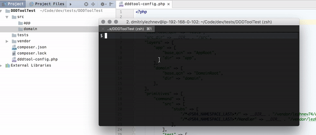

[](https://raw.githubusercontent.com/lezhnev74/ddd-generator/master/LICENSE)

# DDD Classes Generator for 3-layered Application
When you develop clean and decoupled app you have to deal with many interfaces and objects. Where you had one object in RAPID development flow, you have plenty of objects in DDD flow. To speed things up I use this tool to generate primitives related to ServiceBus pattern, CQRS pattern and Clean Architecture.
If you interested - [I blogged about ideas behind this generator](https://lessthan12ms.com/one-step-towards-clean-architecture-from-rapid-application-development/).
 
**Note:** I use PSR-4 so any folder inheritance leads to namespace inheritance (and vice versa). And also type of slashes is irrelevant - \ and / will do the same.

**Note:** This tool is designed to be extensible. So while it contains packs to generate widely used primitives like commands, there can be easily added packs to generate http controllers (+tests) and views and anything else.

**Note:** No Windows support in mind.
 

 
## In a nutshell
This is a handy tool to generate empty class files + test files from templates and put them in predictable places.

* set the config
* run command with given config
 
## What it can generate
* anything you want
* CommandBus: command and handler classes
* QueryBus: request, response and handler
* VO and Entity
* Event
* anything else

Each class is complimented with empty test so I can keep TDD-ing.
 
## Installation
Via composer:
```
composer require lezhnev74/ddd-generator
```
 
## Usage
```
#Comman API
bin/dddtool generate <layer_name> <primitive_type> <primitive_namespace>
```

Command arguments:

* `<layer_name>` - 3 types available: "app", "domain" or "infrastructure"
* `<primitive_type>` - "command" or anything you set up in the config file
* `<primitive_namespace>` - psr-4 inspired path to the file, which also serves as a namespace. F.e. "Account/Commands/SignUp"


More usage examples:

```
# Command generation
bin/dddtool generate domain command Account\Commands\SignUp
  
# Specify config
bin/dddtool generate app event Http\Event\HttpRequestRecieved -c path/to/config.php

# Run with no interaction (mind -y flag)
bin/dddtool generate app event Http\Event\HttpRequestRecieved -y
  
```

## Config
You can set folders where new files will go to.
You can configure each primitive - set its alias and set stubs to generate new files from.


```php
$config = [
    
    // 3 layers with independent folders for sources and for tests
    "layers" => [
        "app" => [
            "src" => [
                "qcn" => "\\DDDGenApp", // What base namespace to use
                "dir" => __DIR__ . "/tmp/src/app", // Where to put new source files
            ],
            "tests" => [
                "qcn" => "\\Tests", // what base namesapce to use
                "dir" => __DIR__ . "/tmp/tests", // Where to put new tests files
            ],
        ],
        "domain" => [
            "src" => [
                "qcn" => "\\DDDGen",
                "dir" => __DIR__ . "/tmp/src/domain",
            ],
            "tests" => [
                "qcn" => "\\Tests",
                "dir" => __DIR__ . "/tmp/tests",
            ],
        ],
        "infrastructure" => [
            "src" => [
                "qcn" => "\\DDDGenInfrastructure",
                "dir" => __DIR__ . "/tmp/src/infrastructure",
            ],
            "tests" => [
                "qcn" => "\\Tests",
                "dir" => __DIR__ . "/tmp/tests",
            ],
        ],
    ],
        
    "primitives" => [
        "command" => [
            // these stubs will go to source folder
            "src" => [
                "stubs" => [
                    // See Templates paragraph on placeholders
                    "/*<PSR4_NAMESPACE_LAST>*/Command" => __DIR__ . "/stubs/SimpleStub.stub.php",
                    "/*<PSR4_NAMESPACE_LAST>*/Handler.php" => __DIR__ . "/stubs/SimpleStub.stub.php",
                ],
            ],
            // these files will go to tests folder
            "test" => [
                "stubs" => [
                    "/*<PSR4_NAMESPACE_LAST>*/CommandTest" => __DIR__ . "/stubs/SimpleTestStub.stub.php",
                ],
            ],
        
        ],
    ],
    
];
```

## Templates
Each primitive can have multiple templates (stubs). F.e. command has command and handler templates, query has request, response and handler templates. Event will only have event template and test. So configuration explicitly declares which files to generate and in which folder.
 
Template support few placeholders which reflects user input:
* `/*<BASE_SRC_NAMESPACE>*/` - looks like `\App` (each layer may have different one)
* `/*<BASE_TEST_NAMESPACE>*/` - looks like `\Domain\Tests`  (each layer may have different one)
* `/*<LAYER>*/` - app or domain or infrastructure
* `/*<PRIMITIVE>*/` - the name of the primitive f.e. `event` or `command`
* `/*<PSR4_NAMESPACE>*/` - looks like `Account\Command\SignUp`, see <primitive_namespace> argument
* `/*<PSR4_NAMESPACE_BASE>*/` - looks like `Account\Command` (without final part)
* `/*<PSR4_NAMESPACE_LAST>*/` f.e. `SignedUp` (just final part)
* `/*<FILENAME>*/` f.e. `SignedUpCommand` (the final filename for this stub)

## How it works
Take for example the config file shown above and let's explain this command:
`bin/dddtool generate domain command Account\Commands\SignUp`

The script will do this:
* first, command will detect the layer for which you want to generate new files. In our case it is "domain"
* then layer's config is detected 
* then command analyze the primitive name, in our case it is "command"
* then config for this primitive is being detected
* then for each stub in the config a new file is prepared. For example, test stub with name `/*<PSR4_NAMESPACE_LAST>*/CommandTest` will actually be created in file `__DIR__ . "/tmp/tests/Account/Commands/SignUp/SignUpCommandTest.php"`.
* user sees the list of files which are supposed to be generated
* after confirmation real files are generated and put to file system.